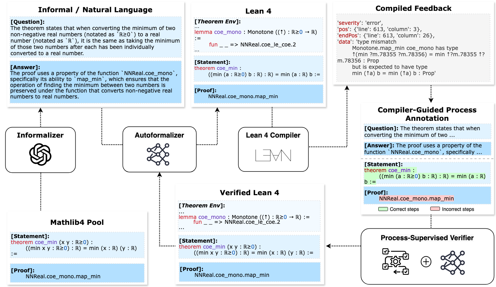

# Process-Driven Autoformalization in Lean 4
This is the official repository for implementing the paper [Process-Driven Autoformalization in Lean 4](https://arxiv.org/abs/2406.01940).

The autoformalization dataset **Form**alization for **L**ean **4** (**<span style="font-variant: small-caps;">forml4</span>**) is released and located in `data/FormL4`. **We will release the code and corresponding finetuned autoformalizer and process-enhanced verifier soon**.

## Overview
An overview of process-driven autoformalization (PDA):



1. **FORML4** dataset is constructed by prompting Gemini-1.5-Pro to informalize theorems extracted from Mathlib 4; 
2. An **autoformalizer** model is trained on FORML4, with output sent to the Lean 4 Compiler for automated feedback; 
3. The feedback can provide **process-level annotations** for the autoformalizer's output which are used to train an effective **process-supervised verifier (PSV)**; 
4. For further enhancement, the autoformalizer is subsequently fine-tuned by the verifier’s feedback, while the verifier can again benefit from the improved autoformalizer’s higher-quality output data.

## Repository Structure

```
PDA
├── annotation
│   ├── informalization_autoformalization
│   ├── model_comparison
│   └── README.md
├── code
│   ├── Automatic-Lean4-Compilation
│   ├── Dataset-Informalization
│   ├── google-cloud-sdk
│   └── Training-Scripts
├── data
│   ├── FormL4
│   │   ├── basic_test.json
│   │   ├── random_test.json
│   │   ├── real_test.json
│   │   └── train.json
│   └── raw.zip
├── prompt
└── requirements.txt
```

## Dataset 

The `data` directory includes both training and testing data (**<span style="font-variant: small-caps;">forml4</span>**) for training and testing the autoformalization task in Lean 4. It contains:
  - The `raw.zip` contains raw theorems extracted from mathlib4;
  - The `FormL4` folder contains the final FormL4 dataset, constructed from LLM informalization and manual processing. See the paper for details about data filtering, construction, etc.

### Breakdown of FormL4

The **<span style="font-variant: small-caps;">forml4</span>** dataset is organized into the following files, ensuring a comprehensive approach to both training and testing your models:

- `train.json`: The training data file containing 14,250 examples to train models. It includes both the formal and informal statements necessary for learning the autoformalization.
- `basic_test.json`: The basic test set (970) is specifically designed to evaluate a model's capability to formalize fundamental theorems. 
- `random_test.json`: The random test set (950) contains a diverse and randomly selected set of problems. 
- `real_test.jsonl`: The real test set represents the out-of-domain test set, featuring 967 natural language mathematics questions and answers distilled from the Arithmo test set. 

## Code

- `Dataset-Informalization`: This folder contains code used to construct the FormL4 dataset. See the `README.md` in the folder for details about replication.

- `Automatic-Lean4-Compilation`: Please visit our GitHub repository for more details about how to automate your Lean 4 installation and compilation: [**Automatic Lean 4 Compilation Guide**](https://github.com/rookie-joe/automatic-lean4-compilation)

- [ ] Training/Evaluating autoformalizer and verifier based on (**<span style="font-variant: small-caps;">forml4</span>**) 

## Human Evaluation Results
Human annotations are provided in the `annotation` sub-directory. It contains human evaluation results for three stages of PDA:
- **Before informalization (stage I)**: We conduct a human evaluation on cross-model preference comparison between gpt-4o and gemini-pro-1.5 (sample size = 10);
- **After informalization (stage II)**: After informalizating the FormL4 dataset, we conduct a manual quality check on informalization success by randomly sampling from three different test sets (sample size = 60).
- **After autoformalization training (stage III)**: After completing training and enhancing the autoformalizer model, the model's autoformalization output was evaluated by human evaluators (sample size = 80).

See the `README.md` in the sub-directory for details.

## Results

### Performance Limitations of Existing LLMs on **<span style="font-variant: small-caps;">forml4</span>**

| **Model**                     | **Random** |        |        | **Basic** |        |        | **Real** |        |        |
| ----------------------------- | ---------- | ------ | ------ | --------- | ------ | ------ | -------- | ------ | ------ |
|                               | Greedy     | Pass@1 | Pass@5 | Greedy    | Pass@1 | Pass@5 | Greedy   | Pass@1 | Pass@5 |
| GPT-3.5-Turbo           | 0.41       | 0.32   | 0.73   | 0.29      | 0.00   | 0.66   | 5.10     | 3.80   | 17.00  |
| GPT-4-Turbo             | 0.49       | 0.41   | 3.42   | 1.47      | 1.14   | 4.38   | 10.20    | 8.70   | 25.10  |
| DeepSeek-Math-Base-7B     | 0.17       | 0.21   | 0.95   | 0.34      | 0.22   | 0.81   | 0.00     | 0.00   | 0.00   |
| DeepSeek-Math-Instruct-7B | 0.58       | 0.22   | 1.71   | 1.16      | 0.47   | 3.04   | 0.30     | 1.60   | 5.30   |
| LLEMMA-7B                  | 0.00       | 0.00   | 0.77   | 0.17      | 0.10   | 0.45   | 0.00     | 0.00   | 0.00   |
| LLEMMA-34B                | 0.00       | 0.00   | 0.18   | 0.00      | 0.00   | 0.00   | 0.00     | 0.00   | 0.00   |
| InternLM-Math-7B           | 0.00       | 0.00   | 0.18   | 0.19      | 0.14   | 0.26   | 1.10     | 1.00   | 3.70   |
| InternLM-Math-20B         | 0.00       | 0.00   | 0.00   | 0.00      | 0.00   | 0.00   | 0.20     | 0.70   | 2.30   |
| Mistral-Instruct-v0.2-7B   | 0.28       | 0.21   | 1.86   | 0.45      | 0.77   | 1.82   | 0.30     | 0.50   | 1.90   |


### Autoformalization Enhancement

#### Performance Comparison of the Enhanced Autoformalizer

We evaluate and compare the performance of an enhanced autoformalization model that incorporates a verifier in its process. This model is denoted as "RFT + Verifier (Ours)" and is compared against baseline and RFT (Rejective Sampling Fine-tuning) models. The RFT approach selects outputs that successfully compile for further fine-tuning of the baseline model, whereas our method additionally checks for correctness as evaluated by the verifier. The results are summarized in the following table.

| Model                 | Quantity | Quality (Acc.) | Test Sets - Basic | Test Sets - Random | Test Sets - Real |
| --------------------- | -------- | -------------- | ----------------- | ------------------ | ---------------- |
| Baseline              | -        | -              | 40.92             | 35.88              | 23.90            |
| RFT                   | + 65K    | 100%           | 44.50             | 38.70              | 26.50            |
| Verifier (Ours)       | + 74K    | 80.50%         | 43.80             | 38.04              | 25.70            |
| RFT + Verifier (Ours) | + 60K    | 100%           | 46.28             | 39.38              | 27.90            |


#### Comparative Performance of the Enhanced Verifier Models

Next, we further evaluated an enhanced verifier by applying it to outputs from the RFT+Verifier model. The evaluation was conducted in relation to a pre-defined experimental setup, comparing process-supervised training (PSV +), which builds upon the previous PSV model, and outcome-supervised training (OSV +), which improves upon OSV. The results can be seen in the table below.

| Dataset | OSV<br />MP1 | OSV <br />Acc | OSV <br />Recall | OSV + <br />MP1 | OSV + <br />Acc | OSV + <br /> Recall | PSV <br /> MP1 | PSV <br /> Acc | PSV <br />Recall | PSV + <br /> MP1 | PSV +<br />Acc | PSV + <br />Recall |
| ------- | ------------ | ------------- | ---------------- | --------------- | --------------- | ------------------- | -------------- | -------------- | ---------------- | ---------------- | -------------- | ------------------ |
| Basic   | 40.71        | 81.34         | 80.12            | 45.13           | 84.22           | 83.18               | 41.49          | 84.59          | 82.73            | 47.30            | 89.14          | 94.17              |
| Random  | 36.14        | 81.16         | 81.07            | 38.21           | 83.13           | 84.45               | 37.52          | 84.68          | 83.47            | 44.32            | 84.20          | 93.70              |
| Real    | 25.75        | 84.45         | 86.21            | 33.41           | 84.45           | 86.21               | 33.42          | 84.34          | 81.08            | 45.10            | 94.18          | 89.31              |


## Contributing

To contribute to this project, please follow the guidelines provided in `CONTRIBUTING.md`. We welcome contributions from the community, including bug fixes, enhancements, or documentation.


## License

This work is licensed under [CC BY 4.0](https://creativecommons.org/licenses/by/4.0/), a Creative Commons Attribution 4.0 International License.

## Citation
If you find the methods and resources provided in this work beneficial, we kindly request that you cite our paper. Below is the BibTeX entry for your convenience:


```bibtex
@article{lu2024process,
  title={Process-Driven Autoformalization in Lean 4},
  author={Lu, Jianqiao and Liu, Zhengying and Wan, Yingjia and Huang, Yinya and Wang, Haiming and Yang, Zhicheng and Tang, Jing and Guo, Zhijiang},
  journal={arXiv preprint arXiv:2406.01940},
  year={2024}
}
```

Thank you for considering our work for your research.


Feel free to reach out with questions or for collaboration.
